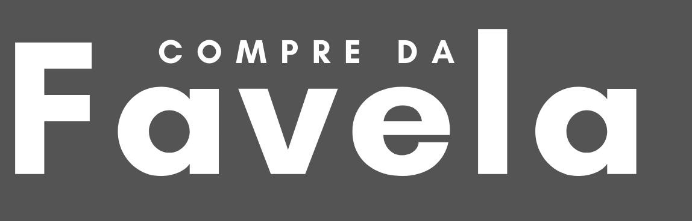

# 

### ✅Quem somos?
Somos a Startup CompreDaFavela e através da análise dos objetivos de desenvolvimento sustentável - Agenda 2030 da ONU, indentificamos que no Brasil existem cerca de 13,6 milhões de pessoas morando em favelas onde 76% dos moradores da favela se sntem discriminadas e muitos deles acreditam que têm menos oportunidades por morarem por morarem nestes locais.

### ✅ Nossa solução
Apresentamos a Plataforma Web CompreFavela, ela é uma iniciativa com foco nas comunidades e favelas existentes nas regiões metropolitanas das capitais brasileiras.

### ✅Objetivos
Promover um aumento da inclusão e uma diminuição das desigualdades, promovendo negócios das comunidades e favelas para o mercado, através de uma plataforma interativa e acessível, através de um portfólio on-line(descrevendo a estrutura dos negócios, os produtos cadastrados e comercializados), realizando um shopping virtual para promover negócios, gerando uma renda e a sustentabilidade econômica da comunidade e das famílias que ali habitam. Promovendo um caminho para atacar a redução das desigualdades e proporcionando um trabalho decente e crescimento econômico. Através dessa conexão seremos um meio para o desenvolvimento dos ODS 1,8,10 e 11 com foco na promoção do trabalho decente, redução das desigualdades, tornar uma comunidade sustentável e visando a redução da pobreza.

## ✅Nosso modelo de negócio
▶Freemium
▶Parcerias com órgãos públicos e empresas privada, percentual sobre as vendas realizadas.

## 📚Nosso time

▶Gleidson Venceslau 🏷 Businnes
▶Isabela Melo 🏷 Businnes
▶Kaue Guedes  🏷 Ux
▶Wally Lucas  🏷 Dev
▶Lucas Rosa  🏷 Dev

## 

✅Deploy no Heroku: https://campuspartydigital.herokuapp.com/

✅Pitch: https://www.youtube.com/watch?v=j5V3MISLCWI&feature=yPitch: 

